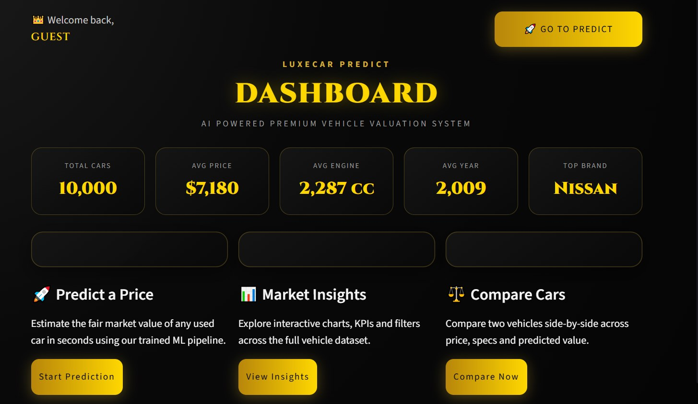
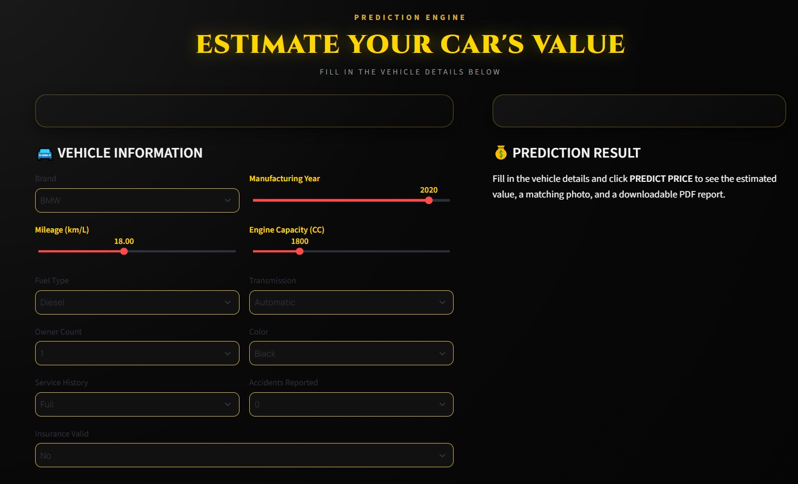
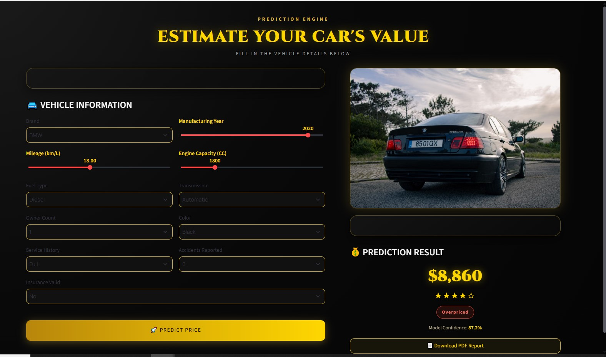
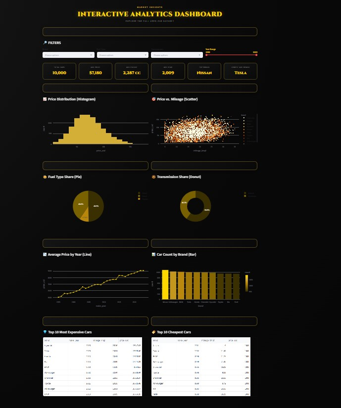
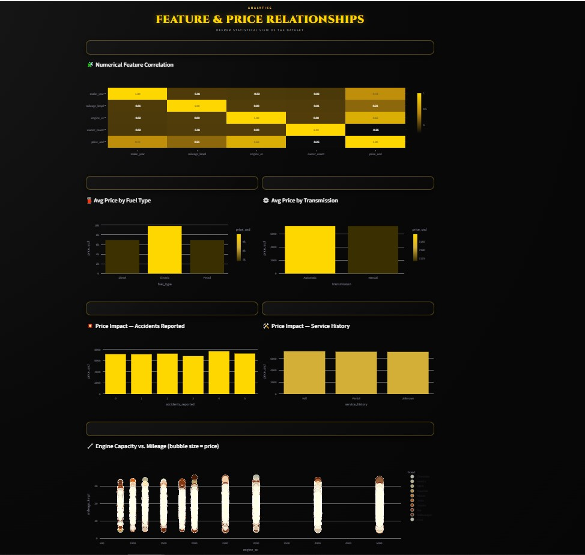
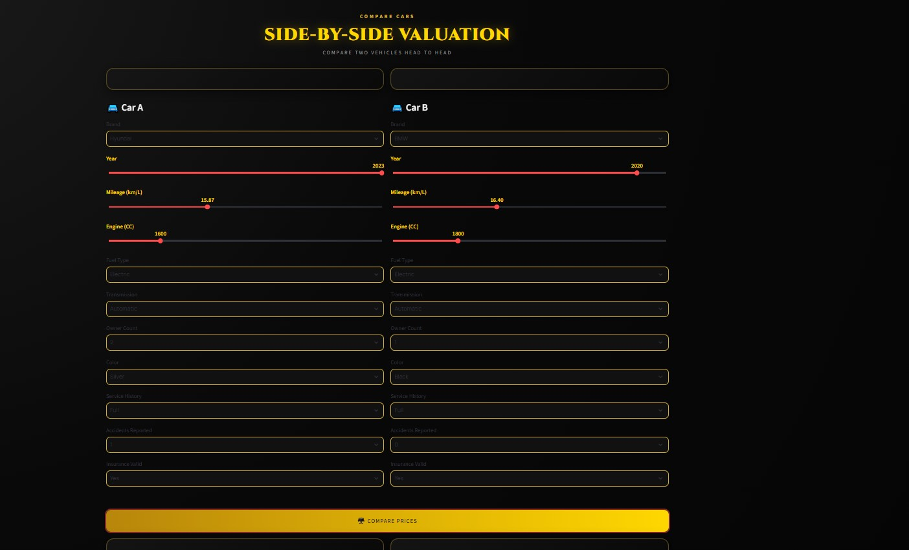
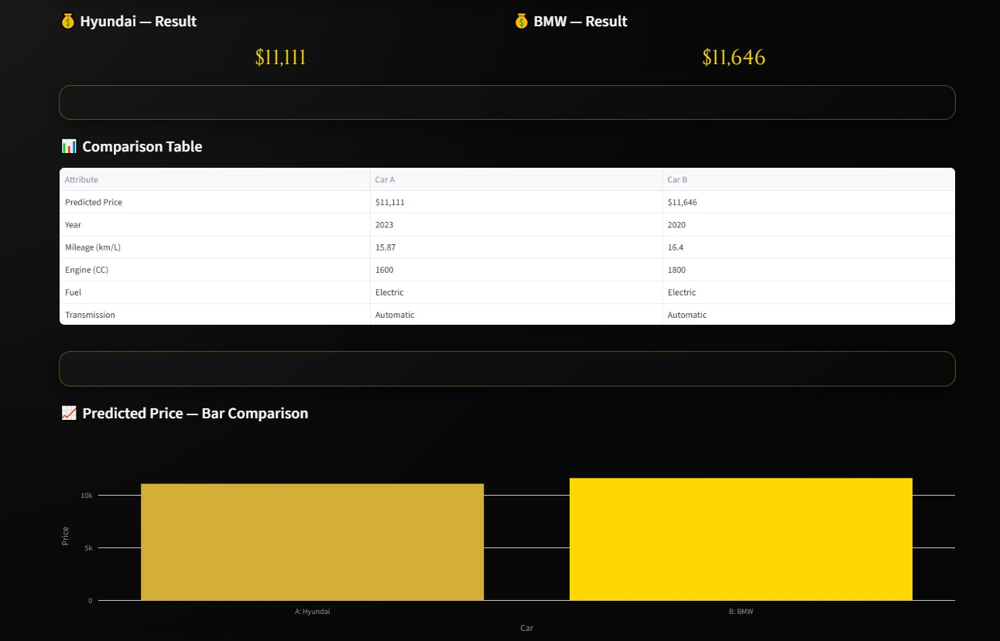

# Used-Car-Price-Prediction
# 🚗 LuxeCar Predict

<p align="center">


</p>

---

# 📌 About The Project

Buying a used car can be challenging because prices vary depending on many factors such as:

- Brand
- Manufacturing Year
- Mileage
- Engine Capacity
- Fuel Type
- Transmission
- Service History
- Accident History
- Insurance Status

LuxeCar Predict is an AI-powered web application that predicts the estimated market value of used cars using Machine Learning and provides an interactive premium dashboard for market analysis.

---

# ✨ Features

✅ AI Price Prediction

✅ Premium Luxury UI

✅ Dynamic Car Images using Pexels API

✅ Interactive Analytics Dashboard

✅ Market Insights

✅ Compare Cars

✅ PDF Report Generation

✅ Multiple Currency Display

✅ Car Rating

✅ Great Deal / Fair Price / Overpriced Detection

---

# 🧠 Machine Learning

The prediction model was trained using:

- Linear Regression
- Scikit-Learn Pipeline
- Feature Engineering
- Data Cleaning
- Model Evaluation

Performance:

| Metric | Score |
|---------|--------|
| MAE | 791 |
| RMSE | 991 |
| R² Score | 0.876 |

---

# 📸 Application Preview

## 🏠 Dashboard

The main dashboard provides quick access to all application features through a modern luxury interface.



---

## 🚗 Price Prediction

Users enter the vehicle specifications including:

- Brand
- Manufacturing Year
- Mileage
- Engine Capacity
- Fuel Type
- Transmission
- Previous Owners
- Color
- Service History
- Accident History
- Insurance Status



---

## 🤖 Prediction Result

After clicking **Estimate Price**, the application displays:

- 💰 Predicted vehicle price
- 🚘 Real vehicle image retrieved dynamically using the **Pexels API**
- 📋 Complete vehicle profile
- ⭐ AI Price Evaluation
- 📄 Downloadable PDF Report



---

## 📊 Market Insights

Interactive visualizations including:

- Price Distribution
- Average Price by Brand
- Fuel Type Analysis
- Manufacturing Year Trends
- Mileage vs Price
- Engine Capacity vs Price



---

## 📈 Advanced Analytics

Explore feature relationships through advanced visualizations.



---

# ⚖️ Vehicle Comparison

Compare two different vehicles using the trained Machine Learning model.

## Step 1 — Enter Vehicle Specifications

Fill in the specifications for both vehicles before running the comparison.



---

## Step 2 — Comparison Result

The application displays:

- 💰 Predicted price for each vehicle
- 📋 Detailed comparison table
- 📊 Interactive price comparison chart
- 🚗 Side-by-side vehicle analysis

# 🛠 Technologies Used

- Python
- Streamlit
- Pandas
- NumPy
- Scikit-Learn
- Plotly
- ReportLab
- Pillow
- Joblib
- Pexels API

---

# 📂 Project Structure

```
Used-Car-Price-Prediction/

│

├── Car_Price_Prediction/

├── Dataset/

├── pages/

├── utils/

├── images/

├── README.md

├── requirements.txt

└── .gitignore
```

---

#  Installation

Clone the repository

```bash
git clone https://github.com/YOUR_USERNAME/YOUR_REPO.git
```

Install packages

```bash
pip install -r requirements.txt
```

Run Streamlit

```bash
streamlit run app.py
```

---

# 📊 Dataset Features

- Brand
- Manufacturing Year
- Mileage
- Engine Capacity
- Fuel Type
- Owner Count
- Transmission
- Color
- Service History
- Accident History
- Insurance Status

---

# 🎯 Future Improvements

- Deep Learning Models
- XGBoost & CatBoost
- Live Used Car APIs
- Real-Time Market Prices
- Arabic Language Support
- User Accounts
- Save Prediction History
- Mobile Version

---

# 📌 Note

> The dataset used in this project is not recent and does not represent the current used car market prices. The predicted prices are intended for educational purposes and to demonstrate a complete end-to-end Machine Learning workflow, including data preprocessing, model training, deployment, analytics, and report generation.

---

# 👩‍💻 Developed By

## Sandy Reda

Faculty of Artificial Intelligence

Horus University

---

⭐ If you like this project, don't forget to give it a Star.
